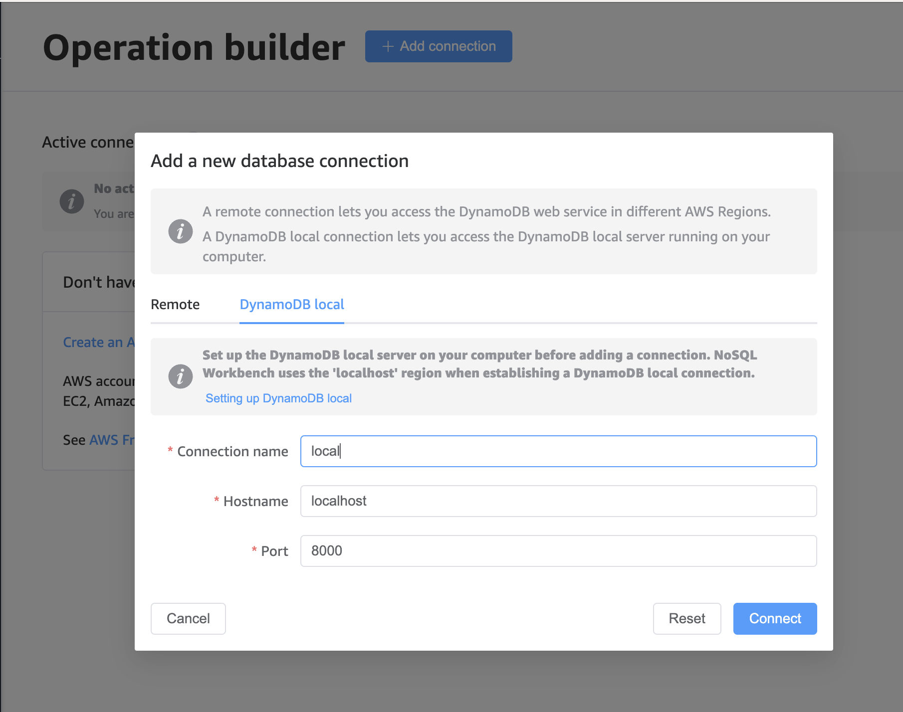

# Albus

> "A wizard is never late, nor early, he is. Precisely when he means to arrive, he does." - Albus the cyber otter

## Running locally

To run locally, you need to do 3 things.

- Pick your target Slack workspace and make your `.env` file
- Spin up a local copy of DynamoDB
- Run the server locally, either through VS Code Debug (F5) or detached as a Docker container (useful before going to production)

To run the server locally (step 3 above), run `npm run build` which will have ESBuild watching for your changes. When you're ready to re-connect to your Slack workspace, use VS Code's F5 debug function to actually start the app. Breakpoints work if you do this.

## Configuring your environment

These instructions are for Apple Silicon Macs. For other devices, we'll have to work together to configure docker on your machine. 

### Install Homebrew 
If you don't have it already, (run `brew -v` to find out if you do)

If you don't, you need to run `/bin/bash -c "$(curl -fsSL https://raw.githubusercontent.com/Homebrew/install/HEAD/install.sh)"` to install Homebrew. 
Follow the prompts to install to its default location and **add it to your path.**

Once you've got that, follow the instructions at https://www.swyx.io/running-docker-without-docker-desktop
* Run `brew install colima`
* Wait a bit
* Get the latest `docker-compose` release from their repo. You need to adjust by chipset in the URL in this command. For Apple Silicon macs, run `sudo curl -L https://github.com/docker/compose/releases/download/v2.28.1/docker-compose-darwin-aarch64 -o /usr/local/bin/docker-compose` (replacing the release number with whatever is latest on the Github page - it was 2.28 when I wrote this)
* Run that last permission command to make docker-compose executable: `chmod +x /usr/local/bin/docker-compose`. 

Then, you should be able to tackle the next config by running `colima start`. 

You'll likely get a "docker not found" fatal error. To fix that, let's install docker itself. `brew install docker`. 

*time passes*

Run `colima start` to get colima going in the background. (Unfortunately, you have to do this every time you want to play until I get that in a background service somehow.)
Run `docker -v` to make sure you're set. Then go get Dynamo. 

### Getting a Local DynamoDB data store. 

1. Get the local docker container for DynamoDB - run `docker pull amazon/dynamodb-local` to get the latest docker image. 
2. Turn it on by running `docker run -p 8000:8000 amazon/dynamodb-local`. Let that sit on the side in its own terminal window. 
3. Go get [NoSQL Workbench for DynamoDB](https://docs.aws.amazon.com/amazondynamodb/latest/developerguide/workbench.settingup.html). Be warned, it's a bit of a thumper in file size. 
4. To see your data, you can use the *Operation Builder* tab on the left sidebar and connect to your local database, as shown here:

5. Don't sweat the rest yet - Albus controls his own migrations in the code, so the tables will be created automatically, as long as you're running the docker container on `localhost:8000`. 

### Setting up your .env locally

There's an example file in the repo called .env.example
Make sure you have your Slack app token and signing secret in that file before trying to debut. 

> Make sure you don't commit your .env file. It's in the .gitignore for a reason. 

### Running from VS Code
* Make sure you ran `npm install` in the repo before doing anything else
* Go ahead and kick off the ESBuild watcher by running `npm run build` - you'll have to leave that in its own terminal, but it'll rebuild the code as you change it for you. 
* To get connected to the Slack workspace from your `.env` file, you can use VS Code's debug function. That'll let you set breakpoints and step through your code. 

### Running locally with Docker

//TODO: Add a `docker-compose` file to bundle this better.

You're going to need a local copy of DynamoDB. To get that:

- `docker pull amazon/dynamodb-local`
- `docker run -p 8000:8000 amazon/dynamodb-local`

Then after that, you can build and run the image with these commands:

- `docker build -t docker.pkg.github.com/hughsername/albus/client:node-dynamo .`
- `docker run -d --add-host host.docker.internal=host-gateway --env-file .env docker.pkg.github.com/hughsername/albus/client:node-dynamo`